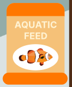
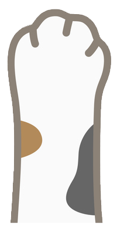

# Anhder The Sea

**Live Site:**  
[https://anhderthesea.vercel.app/](https://anhderthesea.vercel.app/)

---

## Project 0

The topic of this project is to create a web application with 2 buttons, reflecting a team member's personality and experiences. The web project was inspired by the creator's experiences with their pets and incorporates interactive elements.


---

## Tech Stack:

- React JS
- CSS
- Vercel (for deployment)

---

## Buttons:

### Food Shaker  


### Cat Paw  
 

---

## Instructions:

Click on the link above to play the game.

- The food shaker can be dragged with the mouse left and right to position it over the fish tank.
- Click the shaker to drop a food pellet and try to drop it on top of a fish.
- Feeding a fish will fill its heart.
- Periodically, a cat paw will pop up. Click on it to make it retreat.
- If you click too slowly, the fish will become scared, making them hungry again.
- Once all the fish are fed, keep them fed for 8 seconds to restart the game.

Enjoy the game and take care of your virtual fish!

## To Run the Project:

1. Clone the repository to your local machine.
2. Navigate to the project directory.
3. Run the following commands:

   ```bash
   npm install
   npm run dev